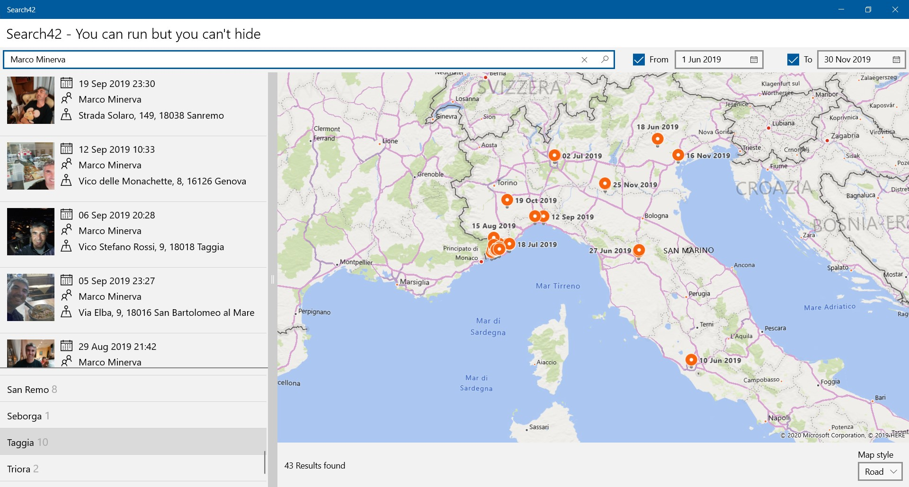

# People Finder

A sample that shows how to enrich an Azure Search index using our artificial intelligence algorithms to create a visual search system in space and time. You can search for people, see their position on a map and filter the result based on dates and places.

This demo requires [Azure Search](https://azure.microsoft.com/en-us/services/search), [Blob Storage](https://azure.microsoft.com/en-us/services/storage/blobs), [Cognitive Services](https://azure.microsoft.com/en-us/services/cognitive-services), [Azure Maps](https://azure.microsoft.com/en-us/services/azure-maps) services and [Azure Functions](https://azure.microsoft.com/en-us/services/functions) to deploy the custom skills. The client is built as a UWP app and you need a [Maps Authentication Key](https://docs.microsoft.com/en-us/windows/uwp/maps-and-location/authentication-key) (this is optional).

**Getting started**

1. Create an Azure Search Index using the **Import data** wizard, attached to a Blob Storage that contains the photos we want to analyze. As we deal with images, in the **Add enrichments** section of the *Add cognitive search (optional)* step, be sure to select the **Enable OCR and merge all text into merd_content field** checkbox. At this time, we don't need to select any of the custom skills available, as we'll configure ours later. Then, in the *Customize target index* step, deselect all the checkboxes, because we'll add our custom fields to the index.

2. After completing the wizard, you can use the [Index Creation Script](Setup/Index.txt) to include all the required fields. Be sure to replace the *<service_name>*, *<index_name>* and *<api_key>* placeholders with your values. The Index shold be like the following:

    

3. Create the Skillset for the Index, using the [Skillset Creation Script](Setup/Skillset.txt). Be sure to replaced the *<service_name>*, *<skillset_name>* and *<custom_skill_url>* with your values. The latter can be an Azure Funtioncs in which you have deplyoed the [FaceSkill](FaceSkill/) project.

4. Create the Indexer for the Index, using [Indexer Creation Script](Setup/Indexer.txt). Be sure to replace the *<service_name>*, *<indexer_name>*, *<api_key>*, *<datasource_name>*, *<skillset_name>* and *<index_name>* with your values.

5. Open and execute the [FaceTrainer](FaceTrainer/) console application. It requires the following command line parameters:

        -r <region> -k <cognitive_services_key> -f <train_images_folder>

    * *region* is the region of Cognitive Service (*westeurope*, *southcentralus*, *eastus* and so on);
    * *cogntive_services_key* is the key of the Cognitive Service you want to use;
    * *train_images_folder* is the root folder the contains all the images to be used to train the Face Service. The folder structure should be the following (each folder contains the train faces for the corresponding person):

    

6. Open the [FaceSkill](FaceSkill/) Azure Function and set the required keys. If you want to run the function locally (for example, using Ngrok), you need to edit the [local.settings.json](FaceSkill/FaceSkill/local.settings.json) file:

        {
          "AppSettings": {
            "FaceSubscriptionKey": "",
            "Region": "",
            "MapsSubscriptionKey": ""
          },
          // ...
        }

    * *FaceSubscriptionKey* is the key of the Cognitive Services you want to use. It must match the key you've set for FaceTrainer, as the function will use it to recognize faces that has been trained;
    * *Region* is the region of Cognitive Service (*westeurope*, *southcentralus*, *eastus* and so on);
    * *MapsSubscriptionKey* is the key of the Azure Map Service.

    When you publish the Function to Azure, you have to add the corresponding keys in the Function app settings section.

7. Insert the required keys in the [Constants.cs](Search42/Search42/Common/Constants.cs) file of the UWP app:

        public class Constants
        {
            public const string SearchServiceName = "";
            public const string SearchIndexName = "";
            public const string ApiKey = "";

            public const string MapServiceToken = "";
        }

    * *SearchServiceName* is the name of the Azure Search Service;
    * *SearchServiceIndex* is the name of your index;
    * *ApiKey* is the query key required to access the Index from within a client app;
    * *MapsSubscriptionKey* is the key required to fully configure the Map control in the app. See [Request a maps authentication key](https://docs.microsoft.com/en-us/windows/uwp/maps-and-location/authentication-key) for further information.

**Let's run**

After inserting in the Blob Storage some photos depicting people you trained Face Service with, you can run the Indexer in order to populate the Index with information about recognized people, date of photo and geolocation. Then, using the client app you'll be able to query the Index and obtain results like the following:

   

**Contribute**

The project is continuously evolving. We welcome contributions. Feel free to file issues and pull requests on the repo and we'll address them as we can.

**Developer Code of Conduct**

The image, voice, video or text understanding capabilities of Azure Cognitive Search use Microsoft Cognitive Services. Microsoft will receive the images, audio, video, and other data that you upload (via this app) for service improvement purposes. To report abuse of the Microsoft Cognitive Services to Microsoft, please visit the Microsoft Cognitive Services website at https://www.microsoft.com/cognitive-services, and use the "Report Abuse" link at the bottom of the page to contact Microsoft. For more information about Microsoft privacy policies please see their privacy statement here: https://go.microsoft.com/fwlink/?LinkId=521839.

People Finder uses the Microsoft Cognitive Services, see https://www.microsoft.com/cognitive-services. Developers using this project are expected to follow the “Developer Code of Conduct for Microsoft Cognitive Services” at http://go.microsoft.com/fwlink/?LinkId=698895. 
